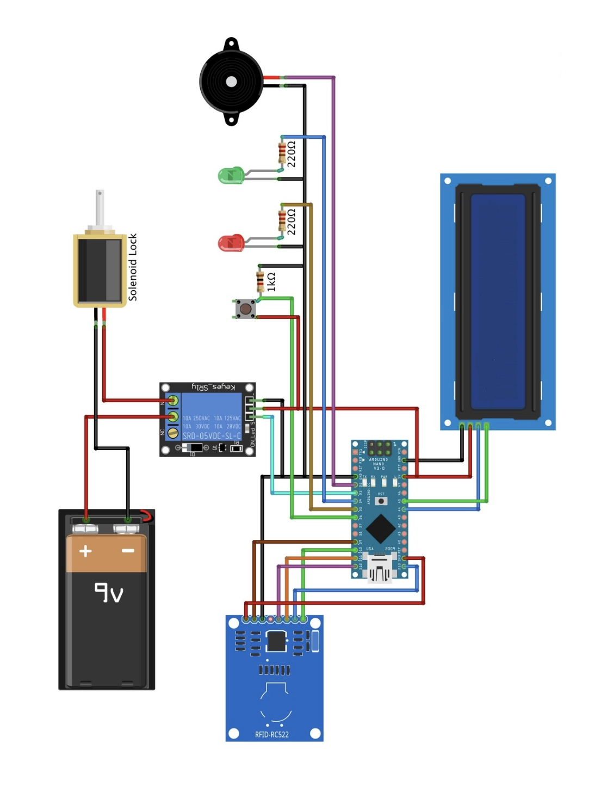

# RFID Door Lock System

The RFID Door Lock System is a secure access control solution designed to provide controlled entry to a physical space. This system utilizes RFID technology to authenticate users, allowing access only to authorized individuals, developed as a mini academic project. Below are the details of this RFID Door Lock System project.

## Table of Contents

- [Overview](#overview)
- [Components](#components)
- [Circuit](#circuit)
- [Installation](#installation)
- [License](#license)

## Overview

The RFID Door Lock System authenticates users using RFID cards or tags. When an authorized card/tag is scanned by the RFID reader, the system unlocks the door. The Arduino Nano controls the logic, and components like a solenoid lock, LCD display, LEDs, and buzzer are integrated into the system.

## Components

- **RFID Reader**: Reads RFID cards/tags and communicates data to the Arduino Nano.
- **RFID Cards/Tags**: Physical tokens assigned to authorized users for scanning.
- **Arduino Nano**: Microcontroller that manages system logic and communication.
- **Relay Module**: Controls the solenoid lock, allowing it to be electronically locked/unlocked.
- **16x2 I2C LCD Display**: Provides visual feedback, displaying system status and messages.
- **12V Solenoid Lock**: Physical lock that can be electronically controlled.
- **Red & Green LEDs**: Indicate system status (locked/unlocked).
- **Resistors**: Current limiting resistors for LEDs.
- **Tactile Button**: Allows manual control of the door (optional feature).
- **Buzzer**: Provides audio feedback for various system events.
- **Jumper Wires**: Connects components on the breadboard.
- **Breadboard**: Platform for prototyping and connecting electronic components.
- **12V Battery**: Power supply for the solenoid lock.

## Circuit

## Installation

1. Clone the Repository.
2. upload Code to Arduino.
3. Connect Components.
4. Run the System.

## License

This project is open-source and available under the [MIT License](LICENSE). By contributing to this project, you agree to abide by its terms.
